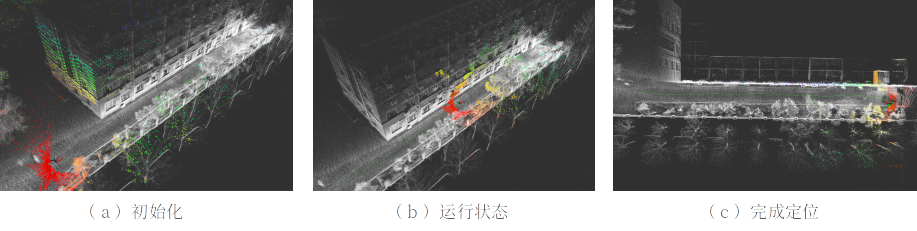

# ESKF_NDT_LOCALIZATION
Use ESKF for pose estimation, and ndt(Normal Distributions Transform) is registered with the point cloud map to provide absolute observation.

Visualization and data reading rely on **ros**.



## Build
Make sure you have completed the installation of the following environments,

```
- ROS1
- Eigen3
- PCL
```

Use the following command to build，

```
cd ~/your_ros_workspace_dir
cd src
git clone https://github.com/Fei-Work/ESKF_NDT_LOCALIZATION.git
cd ~/your_ros_workspace_dir
catkin_make -DCATKIN_WHITELIST_PACKAGES="eskf_ndt"
```

## Run


Firstly, prepare a point cloud map in `.pcd` format. 

Secondly, adjust your configuration in config file. IMU and Lidar's topic and their external reference are necessary.

Then, run this command.
```
roslaunch eskf_ndt eskf_ndt_matching.launch
```
Here, I set two modes to initial pose. The one is using Param, it will publish the initial pose by `init_pose_publisher`. The other is using `2D Pose Estimate` function in rviz. 

Finally, run your bag or publish your IMU and lidar topics in real time.

In addition, the first five seconds of the accepted topic are used to estimate the parameters of the IMU by default.

## Reference
[slam_in_autonomous_driving](https://github.com/gaoxiang12/slam_in_autonomous_driving)_Gaoxiang12

[快速精准定位](https://www.bilibili.com/video/BV1nj411h7oa/?spm_id_from=333.999.0.0&vd_source=200c77392b2575d47017b288076d27f2)_神奇蔡小花